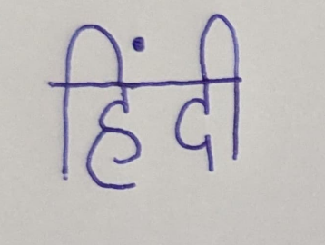

# Indic TrOCR - Handwritten Hindi Word Image to Text Converter
This repository hosts a pretrained Indic TrOCR model capable of extracting handwritten Hindi text (single-word images) with high accuracy. Powered by a Transformer-based architecture, it uses a DeiT image encoder and a RoBERTa-based text decoder, offering a robust solution for digitizing historical or handwritten documents in Hindi.

🚀 This repo features a Streamlit app to run the model interactively.

##🧠 About TrOCR
TrOCR (Transformer-based Optical Character Recognition) is a state-of-the-art OCR framework introduced by Microsoft Research. It combines:

-`Vision Transformer (ViT/DeiT)` as the image encoder
-`Autoregressive Text Transformer (RoBERTa)` as the decoder

This implementation is fine-tuned for handwritten Hindi word-level OCR.

## 📦 Installation

```bash
# Clone the repository
git clone https://github.com/swapnil14g/Hindi-ImagetoTextFile.git
cd Hindi-ImagetoTextFile

# (Optional) Create a virtual environment
python -m venv trocr_env
source trocr_env/bin/activate  # On Windows: trocr_env\Scripts\activate

# Install dependencies
pip install -r requirements.txt
```

## 🧪 Demo

🚀 **Live Demo**

You can try the model in your browser using Streamlit:

👉 [Try it on Streamlit](https://share.streamlit.io/your-username/your-repo-name/main/app.py)  
*(Replace the link with your actual Streamlit deployment URL)*

---

📷 **Demo Walkthrough**

### 1. Upload a Handwritten Hindi Word Image


---

### 2. View the Detected Text Output


---

### 3. Download the Output Text File


---

📝 **Example**

| Input Image | Recognized Text | Output File |
|-------------|------------------|------------------|
|  | विद्यालय | 
